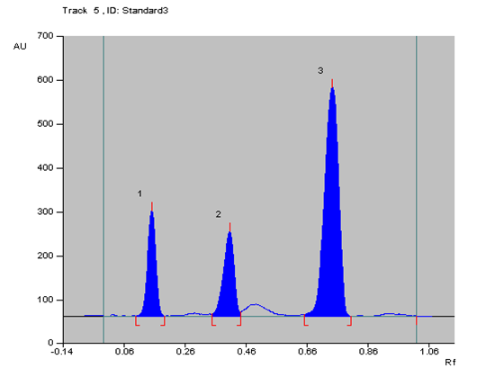
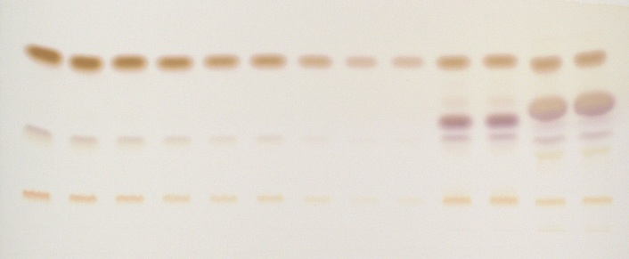
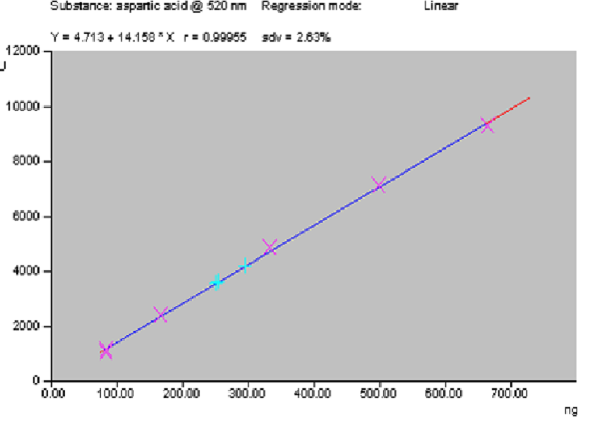
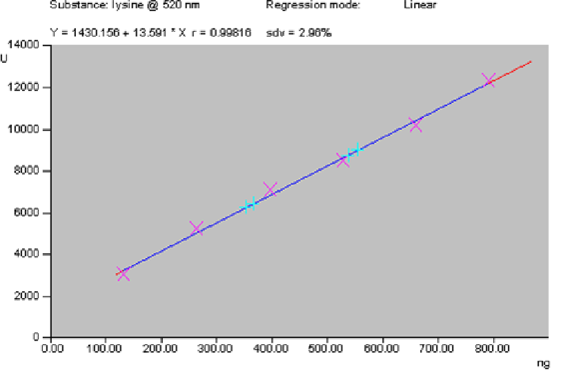
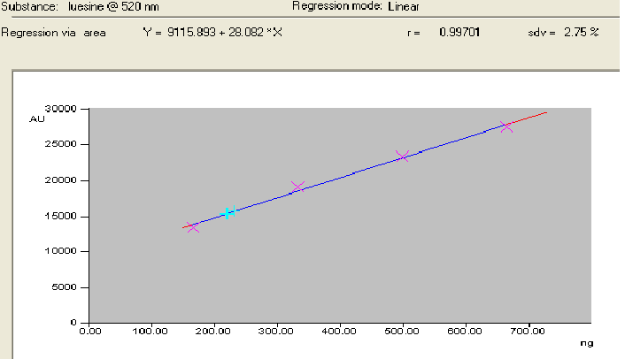

## Procedure

- A stock solution of respective amino acids (aspartic acid, lysine and leucine) was prepared by dissolving individual amino acids (5mg) in water (1ml) and sonicated for 10 minutes over an ultrasonic bath and then makeup with ethanol (5ml) in the test tubes.
- The solution was filtered through filter paper and filtrate was used as sample solution.
- Unknown sample contains these major three amino acids dissolved in (25ml) of water ethanol solution of ratio 1:4 and sonicated for 10 minutes over an ultrasonic bath and then makeup with ethanol (100ml) in the volumetric flask.
- A 20cm × 10cm aluminium backed HPTLC plate coated with cellulose (E. Merck, Darmstadt, Germany) was used for analysis. They were pre-washed with methanol and dried in an oven at 65oC for 10 minutes.
- The samples were applied at 10 mm from the base of HPTLC plate by means of a Camag (Switzerland) Linomat V sample applicator using a syringe (100µL, Hamilton, Bonaduz, Switzerland).
- A linear calibration curve was obtained on applying the increasing concentration of standard amino acids in the range (83-996 ng) for Aspartic acid and leucine while (66-792ng) for Lysine.
- HPTLC analysis was performed on a computerized densitometer scanner 3, controlled by WinCATS planar chromatography manager version 1.4.4. (CAMAG, Switzerland).
- Plate was developed to a distance of 80 mm, in a Camag twin-trough chamber with mobile phase n-butanol: acetic acid: water, 3:1:1 (v/v).
- Amino acids are not UV active, so to visualize the bands plate was derivatized using ninhydrin reagent.
- Plates were evaluated by densitometry at 520 nm with a Camag Scanner 3 for quantification.

## Observation

Use of pre-coated cellulose HPTLC plates with n-butanol: acetic acid: water, 3:1:1, resulted in good separation of the amino acids at 520 nm. Regression analysis of the calibration data for amino acids showed that the dependent variable (peak area) and the independent variable (concentration) were represented by the equations Y = 4.713 +14.158x, Y = 1430.156 +13.59x and Y = 9115.893 + 28.082x for aspartic acid, lysine and leucine respectively. The correlation of coefficient (r2) obtained was 0.999, 0.998 and 0.997 respectively for aspartic acid, lysine and leucine respectively shows a good linear relationship. The concentration of aspartic acid, lysine and leucine in the coconut water was found to 0.07, 0.03 and 0.05% respectively with standard deviation of ±2.78 respectively.

<b>Where, Peak 1 = Lysine 
Peak 2 = Aspartic acid 
Peak 3 = Leucine</b>

 

<b>Derivatized image of amino acids with ninhydrin</b>

 

<b>Calibration curve of Aspartic acid</b>

 

<b>Calibration curve of lysine</b>

 

<b>Calibration curve of leucine</b>

