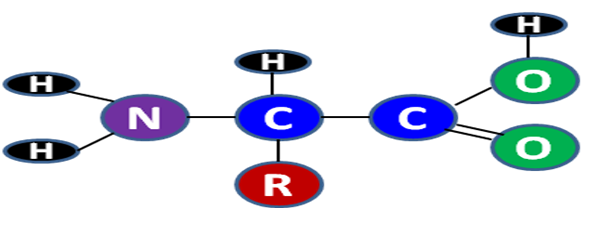

### Reagents

- Aspartic acid
- Lysine
- Leucine
- Ethanol
- Ammonia
- n-butanol
- Ninhydrin
- Acetic acid
- D. water
 

All chemicals used in this study must be of analytical grade.

### Theory

Amino acids are the building blocks of peptides and proteins. They possess two functional groups—the carboxylic acid and amino group giving acidic and basic characters. The common structure of amino acids:

  

The R represents the side chain that is different for each of the amino acids that are commonly found in proteins.

Amino acids are critical to life, and have many functions in metabolism. They are as important for nutrition as vitamins and minerals. Amino acids are used by the body to make tissues, enzymes, hormones and other vital body substances. The body cannot use or assimilate protein in its original state as eaten. The protein must first be digested and split into its component amino acids. When protein is broken down by digestion the result is 20 known amino acids, convey a vast array of chemical versatility. Of the 20 amino acids, eight are termed as essential amino acids (cannot be manufactured by the body). These are isoleucine, leucine, lysine, methionine, phenylalanine, threonine, tryptophane and valine. The remaining 12 amino acids are termed as non-essential. The body can then use these amino acids to construct the protein it needs. The ultimate value of a food protein lies in its amino acid composition. They are also important in many other biological molecules, such as forming parts of coenzymes, enzymes and hormones. They furnish the material from which proteins are synthesized by various cells. They may furnish a source of energy, with some of the amino acids being transformed into glucose and glycogen.

Amino acids are characterized and quantitatively estimated in general by paper chromatography, gel electrophoresis and amino acid analyzer. HPTLC based separations are fast, simple and require very less amount of analyte (µl). Therefore, it is desirable to familiarize the students with HPTLC method of separation and quantification of amino acids.
